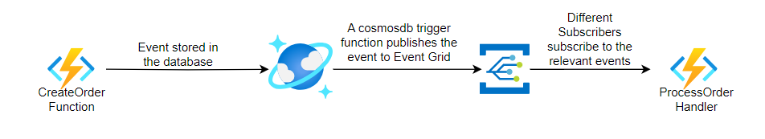

# Eventdriven
A repo to showcase event driven integration on Azure

The pattern looks like this - 

1. API layer stores data in CosmosDB
2. CosmosDB change feed trigger invokes an Azure Function
3. Azure Function publishes event to Event Grid topic
4. Event Grid routes event to subscribed consumers
5. Consumers react to events independently

# Tech Stack 

1. .NET 8 Preview, C# 11.0
2. ARM/Bicep for Azure resources
3. Azure DevOps for CI/CD

